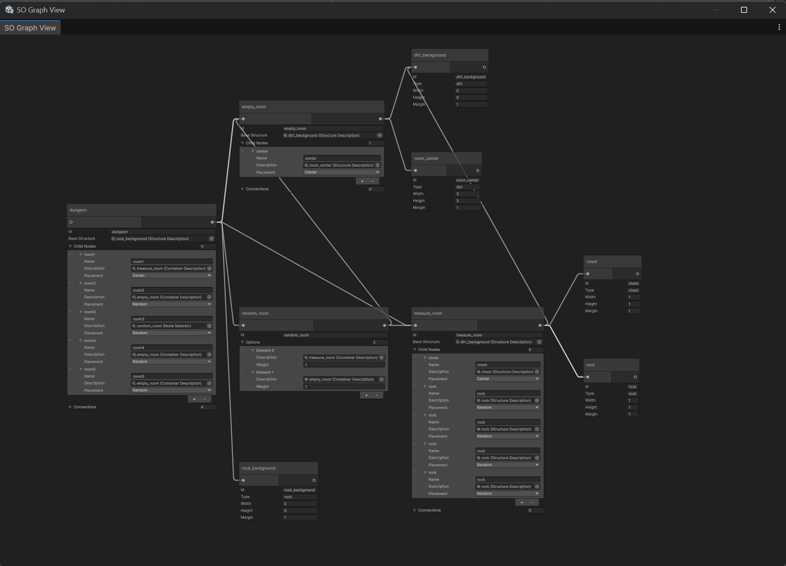

# ScriptableObject Graph View
Unity editor tool that opens a graph view for any ScriptableObject asset and visualizes references to other ScriptableObjects.

## Features
- Open from Project window context menu
- Visualize ScriptableObject references as graph nodes
- Edit serialized fields directly inside nodes
- Auto rebuild when references change

## Installation
Add this repository in Package Manager using Git URL.
https://github.com/waterneverstops/so-graph-view.git

## Usage
Right-click the asset and choose **Open Graph View**.

### Notes
- The graph only follows standard Unity serialized object references.
- The tool is intended for **Editor use only**.
- Changes made in the graph use Unity serialized properties, so they behave like normal Inspector edits.